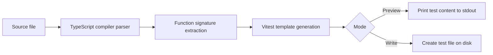

# test-case-forge

Generate starter Vitest unit test files from JavaScript and TypeScript function signatures.

`test-case-forge` is a small CLI for developers who want fast, editable test scaffolds instead of blank files. It reads a source file, finds supported function signatures, and prints or writes a Vitest test file with imports, suites, placeholder arguments, and async-aware calls.

## Who it is for

- Application developers adding first-pass unit tests to existing modules.
- Maintainers who want consistent Vitest starter files across a codebase.
- Teams modernizing JavaScript or TypeScript projects and looking for obvious test coverage gaps.
- Educators, reviewers, and onboarding leads who want examples of how exported functions can be exercised.

## Real-world use cases

- Bootstrap tests for a utility module before replacing placeholders with real assertions.
- Preview the shape of generated tests during code review without writing files.
- Create adjacent `*.test.ts` files for exported functions in a refactor branch.
- Include non-exported top-level helpers as skipped suites so teams can decide whether to export, delete, or test through public behavior.
- Standardize Vitest file layout before adding richer fixtures, mocks, and edge cases.

## How it works



The CLI uses the TypeScript compiler API to parse TypeScript, TSX, JavaScript, and JSX. It detects exported function declarations, exported arrow/function expressions, default function exports, and re-exported named functions. With `--all`, it also includes non-exported top-level helper functions as skipped suites.

Generated output is intentionally a starting point:

- Imports exported functions from the source file.
- Creates one `describe` block per discovered signature.
- Inserts placeholder `undefined` arguments with parameter names in comments.
- Awaits async functions.
- Uses `expect(result).toBeDefined()` as a safe starter assertion.
- Skips non-exported helper suites until the function is exported or tested through public behavior.

## Install

```bash
npm install
npm run build
```

For local development, use Node.js 20 or newer. CI currently runs on Node.js 24.

## Usage

Preview a generated test file:

```bash
npm exec test-case-forge -- src/math.ts
```

Write the default `*.test.ts` file next to the source:

```bash
npm exec test-case-forge -- src/math.ts --write
```

Write to a custom output path:

```bash
npm exec test-case-forge -- src/math.ts --write --output tests/math.test.ts
```

Include non-exported top-level helpers as skipped suites:

```bash
npm exec test-case-forge -- src/math.ts --all
```

## Commands

```bash
npm run lint
npm run typecheck
npm test
npm run build
npm audit --audit-level=moderate
npm outdated
```

`npm outdated` exits with a non-zero status when direct dependencies are behind the registry. That is intentional for dependency hygiene checks.

## Environment and configuration

No environment variables are required to use `test-case-forge`.

The repository includes `.env.example` only as a safe placeholder for future wrapper scripts or local automation. Put machine-specific values in `.env`; `.env` and `.env.*` are ignored by git, while `.env.example` stays safe to commit.

CLI configuration is passed through command flags:

- `<source>`: source file to inspect.
- `--write`: write the generated file instead of previewing it.
- `--output <path>`: choose a custom output path.
- `--all`: include non-exported top-level helper functions as skipped suites.

## Codebase structure

```text
.
|-- .github/
|   |-- dependabot.yml
|   `-- workflows/ci.yml
|-- src/
|   |-- cli.ts
|   |-- generator.ts
|   |-- signatures.ts
|   |-- template.ts
|   `-- *.test.ts
|-- .env.example
|-- eslint.config.js
|-- package.json
|-- tsconfig.json
`-- vitest.config.ts
```

- `src/cli.ts` handles command-line parsing, preview/write mode, and user-facing messages.
- `src/generator.ts` resolves paths, reads source files, and writes generated content when requested.
- `src/signatures.ts` parses source files and extracts supported function signatures.
- `src/template.ts` converts signatures into Vitest starter suites.
- `src/*.test.ts` covers CLI behavior, signature extraction, generation, and template output.

## Security and privacy

- Source analysis runs locally. The CLI does not upload source code or generated tests.
- Generated test files may contain function names, import paths, and parameter names from your codebase. Review output before committing.
- Do not place secrets in source files, generated tests, commit history, or README examples.
- Keep `.env` local. Commit only `.env.example` with placeholder or non-sensitive values.
- Dependency hygiene is checked with `npm audit --audit-level=moderate`, `npm outdated`, Dependabot for npm, and Dependabot for GitHub Actions.

## Dependency maintenance

The project uses:

- `npm audit --audit-level=moderate` to fail on moderate-or-higher known vulnerabilities.
- `npm outdated` to surface dependency drift.
- Dependabot weekly updates for npm packages and GitHub Actions.
- CI checks for install, audit, outdated dependencies, lint, typecheck, tests, and build.
