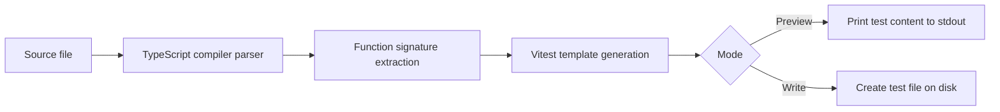

# Architecture

`test-case-forge` reads one source file, extracts supported function signatures with the
TypeScript compiler API, and turns them into a Vitest starter file that is either printed
or written to disk.

Diagram source: [architecture.mmd](architecture.mmd).

## Parsing

The CLI uses the TypeScript compiler API to parse TypeScript, TSX, JavaScript, and JSX.
It detects exported function declarations, exported arrow/function expressions, default
function exports, and re-exported named functions. With `--all`, it also includes
non-exported top-level helper functions as skipped suites.

## Generated output

Generated output is intentionally a starting point:

- Imports exported functions from the source file.
- Creates one `describe` block per discovered signature.
- Inserts placeholder `undefined` arguments with parameter names in comments.
- Awaits async functions.
- Uses `expect(result).toBeDefined()` as a safe starter assertion.
- Skips non-exported helper suites until the function is exported or tested through public behavior.

## Modules

- `src/cli.ts` handles command-line parsing, preview/write mode, and user-facing messages.
- `src/generator.ts` resolves paths, reads source files, and writes generated content when requested.
- `src/signatures.ts` parses source files and extracts supported function signatures.
- `src/template.ts` converts signatures into Vitest starter suites.
- `src/*.test.ts` covers CLI behavior, signature extraction, generation, and template output.
